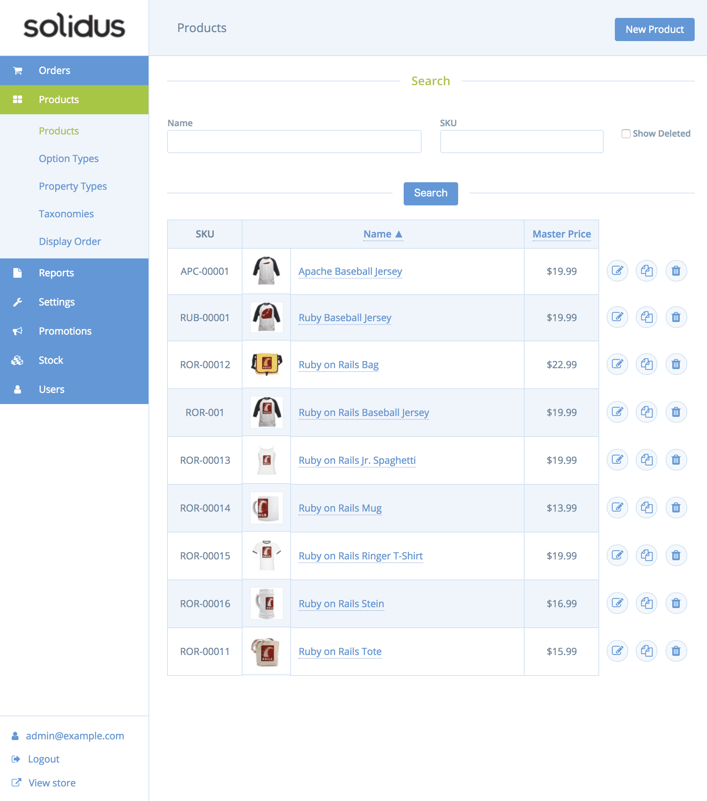

# ポテパンキャンプECサイトリポジトリ

## 開発環境のセットアップ
ポテパンキャンプで開発を行っていくため、一般的なMacでのRails開発環境のセットアップをおこないます。

### homebrew のインストール
ruby のインストールや、その他のパッケージのインストールのため、[homebrew](https://brew.sh/index_ja.html)をインストールします。

ターミナルを開き、下記コマンドを入力します。

```bash
ruby -e "$(curl -fsSL https://raw.githubusercontent.com/Homebrew/install/master/install)"
```

### Docker のインストール
```bash
brew update
brew install caskroom/cask/brew-cask
brew cask install docker
```

### Docker の起動
```bash
open /Applications/Docker.app
```

### プロジェクトのフォーク

[potapanec](https://bitbucket.org/potepancamp/potepanec)へ移動し、左のプラスボタンをクリックします。


** Fork ** this repository のリンクをクリックします。


所有者が自分になっていることを確認して、リポジトリをフォークします。


### プロジェクトの clone

上記でフォークしたリポジトリを自分のPCにクローンします

例：

```
git clone https://[your_account_name]@bitbucket.org/[your_account_name]/potepanec.git
```

### docker-compose up
上記でクローンしたディレクトリに移動し、ターミナルで下記コマンドを実行します

```bash
docker-compose up --build
```

### 動作確認

以下のURLを開き、例のような画面が表示されれば正常に動作しています。

http://localhost:3000/potepan/index.html


### 動作停止
上記（docker-compose up を実行してログが標準出力中のターミナル）で表示した画面を停止し開発を中断するときにはターミナルでctrl+cを押し、更に下記コマンドを実行します

```bash
docker-compose stop
```
同時にイメージやボリュームを削除したい場合は以下の down を利用します。

```bash
docker-compose down
```
### 動作再開

再度開発を進める場合、下記コマンドを実行しDockerを起動します。

#### コンテナ内に入らず開発を再開したい場合（ログを確認しつつ開発したい場合）

```bash
# Dockerコンテナを起動
docker-compose up

# 動作停止
ctrl+c

# コンテナを停止
docker-compose stop
```


#### コンテナ内に入り開発したい場合

```bash
# Dockerコンテナを起動
docker-compose up -d

# コンテナ内にSSH接続
docker-compose exec potepanec bash

# コンテナ内から抜ける
exit

# コンテナを停止
docker-compose stop
```

### トラブルシューティング
#### Railsが起動しない
```bash
もし「A server is already running. Check /app/tmp/pids/server.pid.」のエラーでRailsが立ち上がらない場合、
すでに起動中になってしまって2重で立ち上げようとして失敗している可能性があるので、tmp/pids/server.pidが存在している場合は削除して再度起動してみてください。

原因の多くは作業を中断する際、docker-composeの動作停止（ctrl+c）のみを行い、docker-compose stop を行わず、再開時にdocker-compose upで立ち上げてしまい二重立ち上げの警告が出る事が多いです。
```
### Dockerを使いこなそう！

今後、Dokerを使用しながら課題を進めていくことになります。
Dockerを使いこなせるようになりましょう。

[Dockerを使いこなそう](https://potepan.gitbook.io/camp/be_a_professional_developer/manage_docker)

### 管理者権限を持ったユーザーの作成
http://localhost:3000/admin/ にアクセスしデータベース機能を操作する場合、管理者権限を持ったユーザーの作成が必要となります。

以下のコマンドを実行し、ご自身のメールアドレスとパスワードを設定し、アカウントを作成してください。

```bash
bundler exec rake spree_auth:admin:create

# Create the admin user (press enter for defaults).
# Email [admin@example.com]:
# Password [test123]:
```



予め開発で使用する商品画像などは用意されていますが、こちらの管理画面から自分で商品を登録することもできます。
ぜひ入力・データの出力など色々と試し、データベースの使い方などに慣れて行きましょう。

こちらも参考にしてみてください。
[Solidus の管理画面を操作してみましょう](https://potepan.gitbook.io/camp/before_camp)


### Dockerを利用しない開発環境の構築
スペック不足など、何らかの理由でDockerでの開発が困難な場合は[こちら](./WITHOUTDOCKER.md)を参考に開発環境をセットアップしてください。
