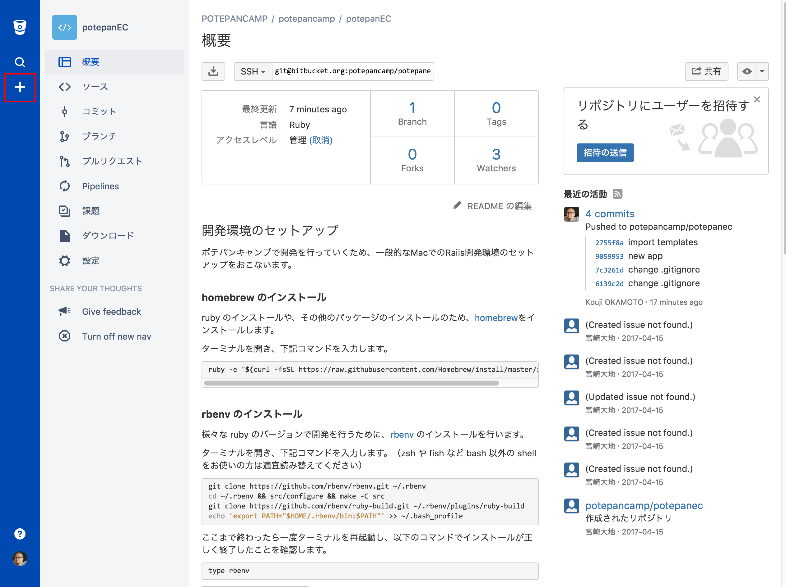
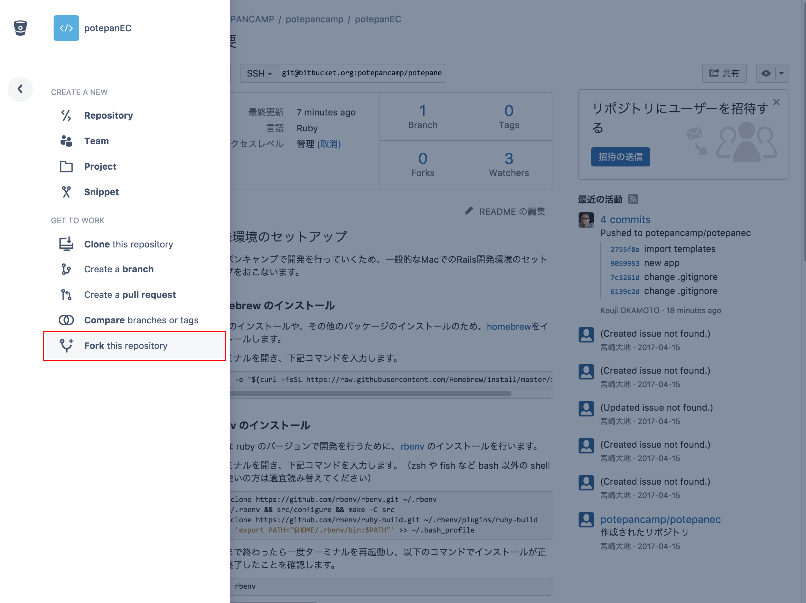

# ポテパンキャンプECサイトリポジトリ

## 開発環境のセットアップ
ポテパンキャンプで開発を行っていくため、一般的なMacでのRails開発環境のセットアップをおこないます。

### homebrew のインストール
ruby のインストールや、その他のパッケージのインストールのため、[homebrew](https://brew.sh/index_ja.html)をインストールします。

ターミナルを開き、下記コマンドを入力します。

```bash
ruby -e "$(curl -fsSL https://raw.githubusercontent.com/Homebrew/install/master/install)"
```

### MySQL のインストール
オープンソースの[RDBMS](https://ja.wikipedia.org/wiki/%E9%96%A2%E4%BF%82%E3%83%87%E3%83%BC%E3%82%BF%E3%83%99%E3%83%BC%E3%82%B9%E7%AE%A1%E7%90%86%E3%82%B7%E3%82%B9%E3%83%86%E3%83%A0) MySQL をインストールします。

```
brew install mysql
brew tap homebrew/services
brew services start mysql
```
### ImageMagick のインストール
画像変換ツールの ImageMagick をインストールします。

```
brew install imagemagick
```


### rbenv のインストール

様々な ruby のバージョンで開発を行うために、[rbenv](https://github.com/rbenv/rbenv) のインストールを行います。

ターミナルを開き、下記コマンドを入力します。（zsh や fish など bash 以外の shell をお使いの方は適宜読み替えてください）

```bash
git clone https://github.com/rbenv/rbenv.git ~/.rbenv
cd ~/.rbenv && src/configure && make -C src
git clone https://github.com/rbenv/ruby-build.git ~/.rbenv/plugins/ruby-build
echo 'export PATH="$HOME/.rbenv/bin:$PATH"' >> ~/.bash_profile
echo 'eval "$(rbenv init -)"' >> ~/.bash_profile
```

ここまで終わったら一度ターミナルを再起動し、以下のコマンドでインストールが正しく終了したことを確認します。

```
type rbenv
```

`#=> "rbenv is a function"` と表示されれば正しくインストールされています。


### ruby 2.4.1 のインストール

ターミナルで下記コマンドを実行します

```
rbenv install 2.4.1
```

### プロジェクトのフォーク

[potapanec](https://bitbucket.org/potepancamp/potepanec)へ移動し、左のプラスボタンをクリックします。



** Fork ** this repository のリンクをクリックします。



所有者が自分になっていることを確認して、リポジトリをフォークします。


### プロジェクトの clone

上記でフォークしたリポジトリを自分のPCにクローンします

例：

```
git clone https://motchang@bitbucket.org/motchang/potepanec.git
```

### ライブラリのインストール

上記でクローンしたディレクトリに移動し、ターミナルで下記コマンドを実行します

```bash
gem install bundler
brew install libxml2
bundle config build.nokogiri --use-system-libraries --with-xml2-include=$(brew --prefix libxml2)/include/libxml2

bundle install
```

### データベースの作成と最新状態へ移行

ターミナルで下記コマンドを実行します

```bash
bundle exec rake db:create
bundle exec rake db:migrate
bundle exec rake db:seed
bundle exec rails g spree:install
bundle exec rake spree_sample:load
```

### 動作確認

以下のコマンドを入力し、教材のアプリケーションを起動します。

```
bundle exec rails s
```

以下のURLを開き、例のような画面が表示されれば正常に動作しています。

http://localhost:3000/potepan/index.html


